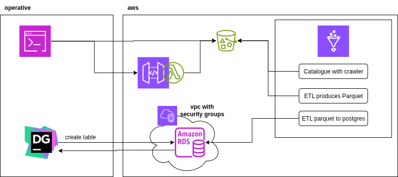

# End-to-End Hardware Correlation Pipeline on AWS Glue

This project demonstrates a complete, end-to-end data engineering pipeline built on AWS. The goal is to ingest, process, and store data for a hypothetical live events technology company to lay the foundation for answering the key business question: **"Is there a correlation between hardware errors, the client's industry, and the age of the hardware?"**

---

## 🏛️ Solution Architecture

The pipeline is built on serverless and managed AWS services to ensure scalability, reliability, and cost-efficiency. The data flows from raw, multi-format sources into a structured analytical data warehouse.

1.  **Data Ingestion (S3):** A data lake in Amazon S3 ingests data from multiple sources, including batch CSV files (`customers`, `sales`, `hardware_logs`) and real-time JSON alerts from an API Gateway and Lambda function.
2.  **Schema Discovery (AWS Glue Crawler):** A Glue Crawler automatically scans the raw data, infers schemas, and populates the AWS Glue Data Catalog with table metadata.
3.  **ETL (AWS Glue):** A serverless Apache Spark job written in PySpark reads data from the Glue Catalog, performs transformations, joins disparate sources, and enriches the data.
4.  **Staging (S3):** The transformed, analytics-ready dataset is written to a 'processed' location in S3 in the optimized Parquet format.
5.  **Data Warehousing (Amazon RDS):** A final Glue job loads the processed Parquet data into a PostgreSQL table in a managed Amazon RDS instance, making it available for querying.

---

## 🛠️ The ETL Process in Action

The core of this project is transforming raw, disparate data into a clean, unified, and analytics-ready table.

### Source Data

The pipeline ingests multiple data formats. Here are samples of the raw CSV files:

**`customers.csv`**
| customer_id | customer_name | industry |
|:---|:---|:---|
| CUST-001 | Visionary Events | Live Events |
| CUST-002 | MegaCorp Studios | Corporate |
| CUST-003 | CineMagic Productions | Film & TV |
| CUST-004 | Global Broadcast Co | Broadcast |
| CUST-005 | NextGen Media | Digital Media |

**`sales.csv`**
| sale_id | customer_id | device_id | sale_date |
|:---|:---|:---|:---|
| SALE-101 | CUST-001 | DEV-A100 | 2025-01-15 |
| SALE-102 | CUST-002 | DEV-B200 | 2025-03-20 |
| SALE-103 | CUST-003 | DEV-A101 | 2025-05-10 |
| SALE-104 | CUST-001 | DEV-C300 | 2025-07-22 |
| SALE-105 | CUST-004 | DEV-B201 | 2025-09-01 |

**`hardware_logs.csv`**
| log_id | timestamp | device_id | event_type | cpu_temp_celsius | memory_usage_gb |
|:---|:---|:---|:---|---:|---:|
| LOG-001 | 2025-10-01T10:00:00Z | DEV-A100 | INFO | 55 | 8.2 |
| LOG-002 | 2025-10-01T10:01:00Z | DEV-A100 | ERROR | 85 | 12.5 |
| LOG-003 | 2025-10-01T11:30:00Z | DEV-B200 | INFO | 60 | 4.1 |
| LOG-004 | 2025-10-01T12:00:00Z | DEV-C300 | INFO | 58 | 9.0 |
| LOG-005 | 2025-10-02T14:15:00Z | DEV-B201 | ERROR | 92 | 14.8 |

**`alerts` api**

Additionally, the pipeline ingests critical alerts from a mock real-time API. A sample JSON payload for an alert looks like this:

JSON

{
  "device_id": "DEV-A100",
  "error_code": "CRITICAL_OVERHEAT",
  "details": "CPU temperature exceeded 100C threshold.",
  "alert_timestamp": "2025-10-03T09:30:00Z"
}

### Transformation Logic

The AWS Glue ETL job performs several key operations:
1.  **Filters** the `hardware_logs` to isolate rows where `event_type` is 'ERROR'.
2.  **Joins** the filtered error logs with `sales` data on `device_id`.
3.  **Joins** the result with `customers` data on `customer_id`.
4.  **Enriches** the data by calculating a new feature, `days_since_sale`.
5.  **Selects and Renames** columns to produce a clean, final schema.

### Final Output

The resulting data is loaded into the Amazon RDS data warehouse. The final `hardware_error_analysis` table contains the unified data, ready for analysis:

| log_id | device_id | cpu_temp_celsius | memory_usage_gb | sale_id | days_since_sale | customer_name | industry |
|:---|:---|---:|---:|---:|:---|---:|:---|
| LOG-005 | DEV-B201 | 92 | 14.8 | SALE-105 | 33 | Global Broadcast Co | Broadcast |
| LOG-002 | DEV-A100 | 85 | 12.5 | SALE-101 | 262 | Visionary Events | Live Events |
| LOG-008 | DEV-B202 | 88 | 13.2 | SALE-108 | 76 | EventXperts | Live Events |

---

## ✨ Technologies & Skills Used

* **Cloud Engineering:** AWS (S3, Glue, RDS, Lambda, API Gateway, VPC)
* **Data Processing:** Python, PySpark, Pandas, SQL
* **Other:** Git, GitHub
